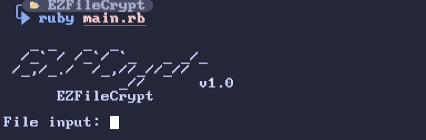

# EZFileCrypt

<p align="center">
  <a name="top" href="#octocat-hi-there-thanks-for-visiting-">
    
  </a>
</p>

# Info

<p align="center">

 <a href="https://github.com/vizeeart">
    
  </a>
<a href="https://github.com/vizeeart/followers">
  </a>
<a href="https://github.com/vizeeart/EZFileCrypt/stargazers/">
<a href="https://github.com/vizeeart">
  
</a>
<a href="https://github.com/vizeeart">
  
</a>
<a href="https://github.com/vizeeart">
  
</a>
<a href="https://github.com/vizeeart">
  
</a>
</div>
</p>

##
### :octocat: Hi, thanks for spending your time visiting this repository !
<p>
  This is a tool for encrypting Ruby files using the zlib and base64 algorithms.
</p>


# Installation Package
<details open>
<summary>Termux (Android) / Linux</summary>

- ```bash
  $ apt update && apt upgrade
  ```

- ```bash
  $ apt install ruby git -y
  ```

## Installation Project

- ```bash
  $ git clone https://github.com/vizeeart/EZFileCrypt
  ```

- ```bash
  $ cd EZFileCrypt
  ```

- ```bash
  $ ruby main.rb
  ```